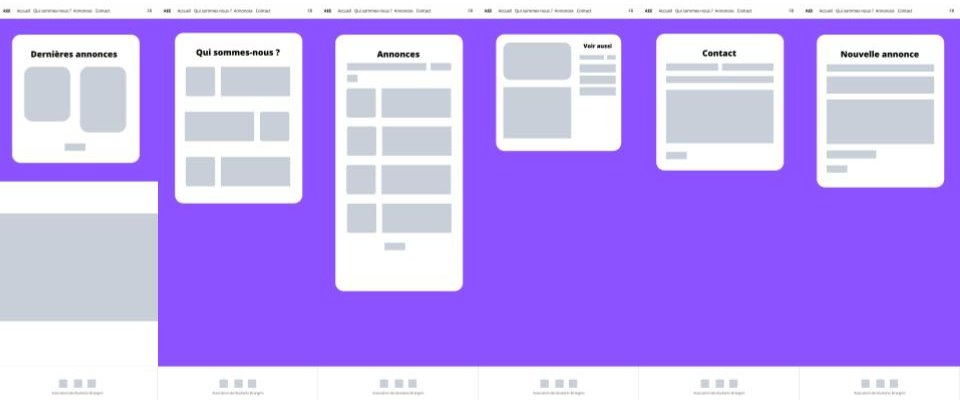

# Site web Association des Etudiants Etrangers

Projet de l'UE Développement Web 2 (L2)

## Description

### Page 1 - Accueil

- Fichier index.php
- Dernières annonces sous forme de cartes
- Lien vers la page d'annonces
- Pour chaque annonce, lien vers la page qui la détaille
- Carrousel avec des photos de l’association / des adhérents / des évènements / etc...

### Page 2 - Qui sommes nous ?

- Fichier presentation.php
- Série de photos et de paragraphes pour présenter l’association

### Page 3 - Annonces

- Fichier events.php
- Toutes les annonces sont affichées les unes après les autres
- Les dernières annonces sont affichées en premières
- Chaque annonce a une image associée
- Les annonces sont affichées par lot de 4
- Bouton "voir plus" pour afficher les annonces suivantes qui disparait une fois toutes les annonces vues
- Bouton « ajouter une annonce » qui redirige vers la page de création d’annonce
- Barre de recherche pour rechercher une annonce

### Page 4 - Créer une annonce

- Fichier newEvent.php
- Formulaire
- Le format du fichier fourni devra obligatoirement être celui d'une image sinon le formulaire ne sera pas validé
- Message indiquant si le formulaire est invalide et les zones concernées deviennent rouges
- Redirection vers la page d'annonces une fois l'annonce publiée

### Page 5 - Détails d'une annonce

- Fichier eventDetails.php
- Annonce sur la gauche avec son image et son titre
- Lien vers d'autres annonces à droite avec barre de recherche

### Page 6 - Contact

- Fichier contact.php
- Formulaire de contact
- Message indiquant si le formulaire est invalide et les zones concernées deviennent rouges

**Navbar** : un élément dynamique pour choisir la langue

**Footer** : liens vers les réseaux sociaux sous forme d'icones
